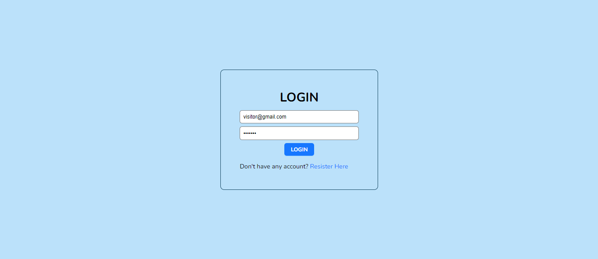
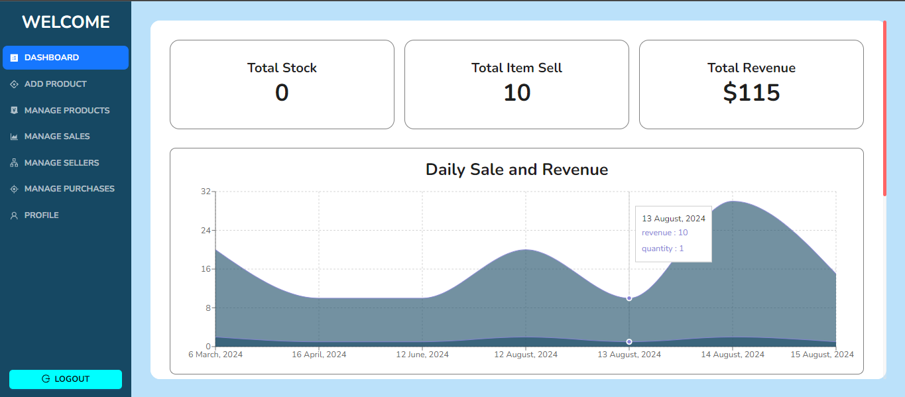
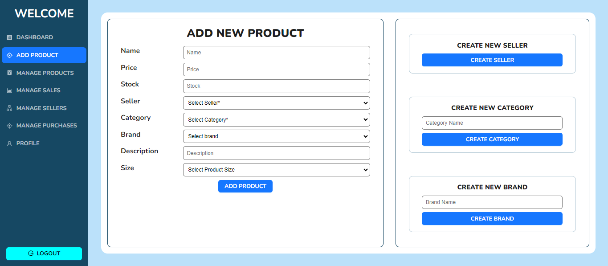
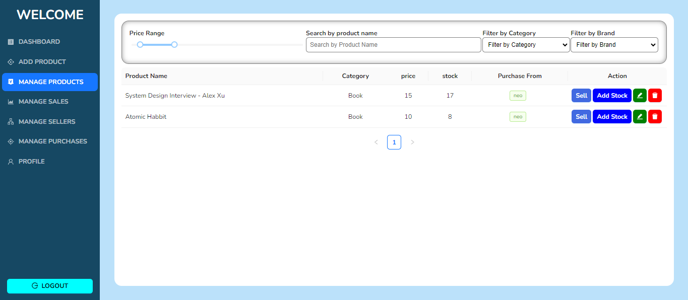
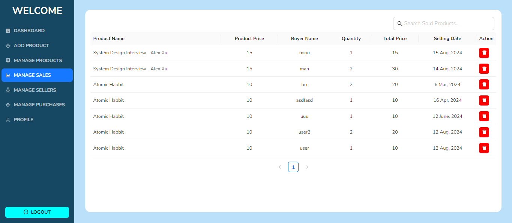

# Inventory Management System - A full stack Inventory management system

### Live Site: https://inventory-navy.vercel.app

<!-- ### Backend Server: https://inventory-420.vercel.app -->

# Features

1. Authentication - Register new account and login into existing account
2. Manage and update own profile page and change password
3. Create -
   - Create new product with various information
   - Create Seller
   - Create Product Category
   - Create Product Brand
4. Manage product -
   - View All Product of login user
   - filter and search using different fields
   - pagination
   - update existing product
   - delete existing product
   - create new variant of product
   - sell that product
5. Manage sale -
   - View all sale with pagination
   - update sale data
   - delete sale data
6. Manage seller -
   - View all seller with pagination
   - update seller data
   - delete seller data
7. Manage purchase -
   - View all purchase with pagination
   - update purchase data
   - delete purchase data
8. Sale history - View sales history categorized by:
   - Yearly
   - Monthly
   - Weekly
   - Daily

# Pages

